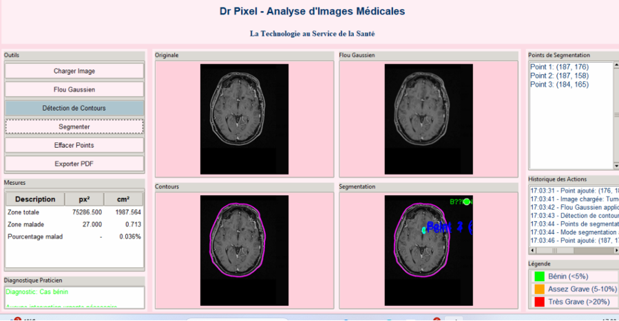

# Portfolio – Ingrid Sterle, élève ingénieure en 5ème année à l'ESME SUDRIA
  
Je suis **Ingrid Sterle**, étudiante ingénieure à **ESME Sudria**, spécialisée en **Intelligence Artificielle, Data Science et Machine Learning**.  
Ce portfolio regroupe mes principaux projets réalisés à l’école et en entreprise, alliant rigueur scientifique & innovation.

---

## 👩‍💻 À propos de moi

Ingénieure en formation à ESME Sudria, passionnée par l’Intelligence Artificielle, la Data Science et le Machine Learning, je transforme les données en solutions concrètes et innovantes.

Je m’investis pleinement dans chaque projet, avec rigueur, curiosité et créativité, pour comprendre les enjeux et délivrer des résultats à forte valeur ajoutée.

Convaincue que chaque mission est une opportunité d’apprendre et de contribuer, je prends à cœur la responsabilité et les objectifs qui me sont confiés, et je m’engage à apporter impact, fiabilité et innovation à l’équipe et à l’entreprise.

📍 Basée à Paris  
📫 Contact : [ingrid.sterle@esme.fr]  
🔗 [LinkedIn](https://linkedin.com/in/ingridsterle)  
💻 [GitHub](https://github.com/Ingridsterle)
  

---

## 💼 Mes Projets

---

### ❤️ Projet 1 – Prédiction Cardiaque (MLOps – ESME Sudria)
|  |  
|:--:|:--:|
| *Interface de l’application de prédiction cardiaque* | *Pipeline complet d’entraînement et de suivi MLflow* |

**Période :** Depuis octobre 2025  
**Contexte :** Projet de Machine Learning orienté MLOps au sein de l’ESME Sudria.  
**Objectif :** Développer une application capable de prédire la présence de maladies cardiaques à partir de données médicales structurées.  
**Réalisation :**
- Mise en place d’un pipeline complet de traitement des données, entraînement et évaluation du modèle.  
- Suivi des expérimentations avec **MLflow**.  
- Déploiement d’un modèle fiable et explicable.  

🧰 **Outils :** Python, Scikit-learn, MLflow, Pandas, Streamlit  
🔗 [Lien GitHub du projet](https://github.com/Ingridsterle/HeartDiseaseMLops)

---

### 🔮 Projet 2 – Modèle prédictif de dépenses (Stage chez Valeo)
|  |
|:--:|:--:|
| *Architecture du modèle prédictif des heures projet* | *Indicateurs de performance utilisés (BAC, SPI, CPI...)* |

**Période :** Juin 2025 – Septembre 2025  
**Contexte :** Stage en **Intelligence Artificielle et Machine Learning** au sein du groupe Valeo.  
**Objectif :** Concevoir un modèle prédictif des dépenses en heures pour les projets industriels internes.  
**Réalisation :**
- Création d’un dataset consolidé à partir d’exports multiples.  
- Intégration d’indicateurs de gestion (BAC, EV, AC, SPI, CPI).  
- Implémentation et optimisation de modèles de ML (**Random Forest**, **Extra Trees**, **AdaBoost**).  
- Développement de **LLM (Large Language Models)** pour améliorer les agents IA internes.  

🧰 **Compétences clés :** Python, PyCaret, Machine Learning, Forecast, Excel, Prompting LLM  
🎯 **Résultats :** Modèle fiable, facilement interprétable et exploitable pour le pilotage industriel.

---

### 🧠 Projet 3 – IHM de Segmentation d’Image (ESME Sudria)
|  |  ![Résultat de segmentation] (./images/P1.png)| ![Objectifs] (./images/IM4.png)|

 
| *Interface graphique de l’application Python* | *Exemple de segmentation et détection de contours* |

**Période :** Juin 2025  
**Contexte :** Projet académique en traitement d’images médicales.  
**Objectif :** Développer une **interface utilisateur (IHM)** permettant d’importer une image médicale, appliquer un flou gaussien, détecter et tracer les contours, puis segmenter les zones pathologiques.  
**Réalisation :**
- Développement complet en **Python** avec **OpenCV** et **NumPy**.  
- Création d’une échelle de mesure pour évaluer la gravité d’une anomalie.  
- Interface simple, intuitive et utile à des fins de diagnostic assisté.  

🧰 **Technologies :** Python, OpenCV, NumPy, Tkinter  
🎯 **Résultat :** Application fonctionnelle, capable d’identifier et de quantifier des anomalies sur des images médicales.

---

### 🦾 Projet 4 – IHM Domotique pour Personnes Aveugles (ESME Sudria)
|  |  
 
| *Maquette miniature du couloir et de la porte automatisée* | *Schéma des capteurs et du moteur DC* |

**Période :** Juin 2022
**Contexte :** Projet d’ingénierie mêlant hardware et software, orienté accessibilité et sécurité.  
**Objectif :** Créer une **maquette domotique intelligente** capable d’assister une personne atteinte de cécité.  
**Réalisation :**
- Construction d’une maquette miniature avec capteurs à ultrasons, capteurs infrarouges et moteur à courant continu.  
- Coordination du hardware et du software pour détecter les obstacles et signaler les dangers.  
- Mise en place d’un système d’alarme en cas de mauvaise ouverture de porte.  

🧰 **Technologies :** Arduino, capteurs IR/Ultrason, Python (communication série), C++  
🎯 **Résultat :** Prototype fonctionnel, démontrant la faisabilité d’une solution d’assistance connectée.

---

## 🧩 Compétences techniques

| Domaine | Compétences principales |
|----------|------------------------|
| **Machine Learning & IA** | Scikit-learn, PyCaret, MLflow, Random Forest, AdaBoost |
| **Data Science** | Python, Pandas, NumPy, Excel, Power BI |
| **Traitement d’image** | OpenCV, Segmentation, Détection de contours |
| **Développement logiciel** | Python, Streamlit, Tkinter |
| **Systèmes embarqués** | Arduino, capteurs, programmation C++ |
| **Langage naturel / IA générative** | Prompting, LLM, Agents IA |

---

 

## 🤝 Me contacter

📧 **Email :** [ingrid.sterle@esme.fr]  
🌐 **LinkedIn :** [linkedin.com/in/ingridsterle](https://linkedin.com/in/ingridsterle)  
💻 **GitHub :** [github.com/Ingridsterle](https://github.com/Ingridsterle)  

> 
---
