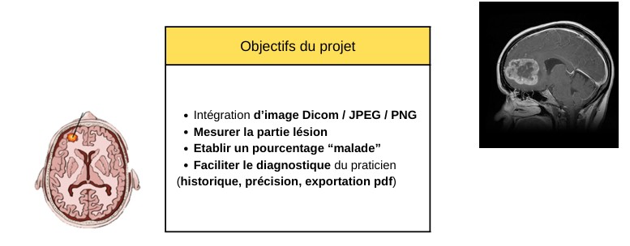
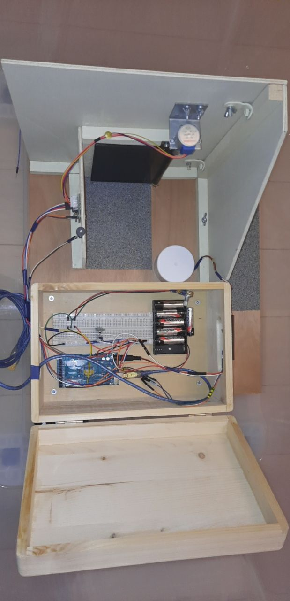

# Portfolio – Ingrid Sterle  
Élève ingénieure en 5ᵉ année à l’ESME Sudria

Elève ingénieure à l’ESME Sudria.  
Ce portfolio présente une sélection de projets réalisés en formation et en entreprise.
---

## À propos de moi

Actuellement en Master 2 (Bac+5) à l’ESME Sudria, je me spécialise dans les domaines de l’Intelligence Artificielle et de la Data Science.  
J’aborde chaque projet de manière rigoureuse et déterminé afin de proposer des solutions fiables, pertinentes et adaptées aux besoins opérationnels.

Curieuse et engagée, je considère chaque mission comme une opportunité d’apprendre. 

**Localisation :** Basée à Paris  
**Email :** ingrid.sterle@esme.fr  
**LinkedIn :** https://linkedin.com/in/ingridsterle  
**GitHub :** https://github.com/Ingridsterle

---

## Mes projets

---

### Projet 1 – Prédiction de maladies cardiaques (MLOps – ESME Sudria)

  
 
*Interface de l’application de prédiction cardiaque et pipeline MLflow* 

**Période :** 
Depuis octobre 2025  (fin prévu en Mars, projet de fin d'Etudes(PFE))

**Objectif :** 
L'intelligence artificielle est de plus en plus utilisée en santé, notamment
pour le diagnostic, la détection précoce des pathologies et l'aide à la décision
clinique. Ces systèmes sont classés à "haut risque" par le EU AI Act. Au-delà
du RGPD, ils doivent démontrer qualité des données, robustesse, gestion de
risques, traçabilité complète, supervision humaine et surveillance post-
Confiance, Knowledge Proofs et déploiement.

Les pratiques MLOps actuelles doivent donc intégrer EU AI Act
nativement ces aspects. L'objectif de ce projet est d'étudier et analyser les
contraintes du EU AI Act sur les systèmes d'IA et particulièrement dans le
domaine médical et de concevoir un pipeline MLOps intégrant entre autres
des modules d'entraînement et de validation robustes et des mécanismes de
traçabilité et de monitoring continu.

**Réalisations :**
- Mise en place d’un pipeline complet : préparation des données, entraînement, validation, evaluation, Suivi. 
- Suivi et gestion des expérimentations via MLflow.  
- Déploiement d’un modèle interprétable et opérationnel.

**Technologies :** 
Python, Scikit-learn, MLflow, Pandas, ZKPb

**Code source :** 
https://github.com/Ingridsterle/HeartDiseaseMLops

---

### Projet 2 – Modèle prédictif de dépenses (Stage – Valeo)

  
 
*Architecture du modèle prédictif et indicateurs clés utilisés*

**Période :** 
Juin 2025 – Septembre 2025  

**Objectif :** 
Concevoir un modèle permettant d’anticiper les dépenses en heures pour des projets industriels internes.

**Réalisations :**
- Création d’un dataset consolidé à partir d’exports multiples.  
- Intégration d’indicateurs de pilotage (BAC, EV, AC, SPI, CPI).  
- Développement et optimisation de modèles de prédiction (Random Forest, Extra Trees, AdaBoost).  
- Contribution au développement d’agents IA internes basés sur des LLM.

**Compétences mobilisées :** 
Python, PyCaret, Machine Learning, Forecasting, Excel, LLM  

**Résultats :** 
Modèle fiable, interprétable et utilisable par les équipes projets.

---

### Projet 3 – IHM de segmentation d’images médicales (ESME Sudria)

  |  
 
 *Interface développée en Python* | *Exemple de segmentation et détection de contours* 

**Période :**
 De Janvier à Juin 2025  

**Objectif :** 
Concevoir une interface graphique permettant d’importer une image médicale, d’appliquer un flou gaussien, de détecter les contours et de segmenter les zones pathologiques.

**Réalisations :**
- Développement d’algorithmes de traitement d’image avec OpenCV et NumPy.  
- Mise en place d’un outil de mesure pour quantifier la gravité d’une anomalie.  
- Conception d’une interface intuitive destinée à l’aide au diagnostic.

**Technologies :** 
Python, OpenCV, NumPy, Tkinter 

**Résultat :** 
Application fonctionnelle capable d’identifier et de quantifier des anomalies sur des images médicales.

---

### Projet 4 – Maquette domotique pour personnes aveugles (ESME Sudria)

  
 
*Maquette domotique équipée de capteurs et d’un système automatisé* 

**Période :** 
Juin 2022  

**Objectif :** 
Développer une maquette domotique d’assistance destinée aux personnes non-voyantes.

**Réalisations :**
- Conception d’une maquette intégrant capteurs infrarouges, ultrasons et moteur DC.  
- Synchronisation hardware/software pour la détection d’obstacles.  
- Intégration d’un système d’alerte en cas de mauvaise ouverture de porte.

**Technologies :** 
Arduino, capteurs IR/Ultrasonic, Python (communication série)

**Résultat :** 
Prototype fonctionnel démontrant la faisabilité d’un dispositif d’assistance sécurisé.

---

## Compétences techniques

| Domaine | Compétences |
|--------|-------------|
| Machine Learning & IA | Scikit-learn, PyCaret, MLflow |
| Data Science | Python, Pandas, NumPy, Excel, Power BI |
| Traitement d’image | OpenCV, segmentation, détection de contours |
| Développement logiciel | Python, Tkinter |
| Systèmes embarqués | Arduino, capteurs, programmation C++ (unity (Réalité Virtuelle))|
| IA générative & NLP | Prompting, LLM |

---

## Me contacter

**Email :** ingrid.sterle@esme.fr  
**LinkedIn :** https://linkedin.com/in/ingridsterle  
**GitHub :** https://github.com/Ingridsterle

---
